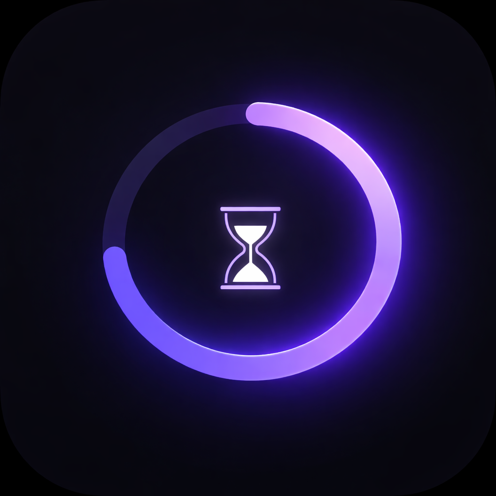

<p align="center">
  
</p>

# Pulse

A remote-controlled ambient timer display for Android. Turn a spare phone or tablet into a beautiful countdown timer you control from your desktop via CLI, Raycast, menu bar app, or HTTP API.

## Features

- **Preset & custom timers** — quick-start 5m/25m/15m/90m presets or set any duration
- **Pomodoro mode** — auto-cycling focus/break sessions with configurable durations and cycles
- **Timer queue** — stack multiple timers that run back-to-back
- **Pause/resume** — pause and resume any running timer
- **6 themes** — Dark, Ambient, Warm, Forest, Ocean, Rose
- **Remote control** — HTTP REST API + WebSocket for real-time updates
- **Multi-device sync** — auto-discovers other Pulse devices on your network via mDNS
- **Tablet-responsive** — adaptive layout with queue sidebar on larger screens
- **macOS menu bar** — live countdown by the notch with controls dropdown
- **Foreground service** — keeps running with screen-on, vibration alerts on completion

## Architecture

```
┌──────────────┐                  ┌──────────────┐
│   CLI / RC   │     HTTP/WS      │  Pulse App   │
│  Menu Bar    │ ──────────────── │  (Android)   │
│  (desktop)   │    :7878         │              │
└──────────────┘                  └──────────────┘
                                        │
                                   mDNS / Bonjour
                                   _pulse._tcp
```

## Installation

### Android App

Build and install from source:

```bash
cd app
flutter pub get
flutter build apk --release
# Install the APK from build/app/outputs/flutter-apk/app-release.apk
```

Or run in debug mode:

```bash
cd app
flutter run
```

### CLI

Requires [Go 1.25+](https://go.dev/dl/).

```bash
cd cli
go build -o pulse .

# Move to your PATH
mv pulse ~/.local/bin/
# or
sudo mv pulse /usr/local/bin/
```

The CLI auto-discovers your Pulse device via mDNS. On first use it caches the device address in `~/.config/pulse/config.json`. You can also specify `--host` manually.

#### CLI Usage

```bash
# Timer control
pulse start 25m --label "Focus"
pulse stop
pulse pause
pulse resume
pulse status              # shows progress bar, queue, pomodoro info
pulse status --json       # machine-readable output

# Pomodoro
pulse pomodoro                                    # default: 25m focus, 5m break, 4 cycles
pulse pomodoro --focus 30 --short-break 5 --long-break 15 --cycles 6

# Timer queue
pulse queue add 25m --label "Focus"
pulse queue add 5m --label "Break"
pulse queue list
pulse queue clear
pulse skip                # skip to next in queue/pomodoro

# Appearance
pulse theme ambient       # dark | ambient | warm | forest | ocean | rose

# Network
pulse discover            # find Pulse devices on the network
```

### macOS Menu Bar App

Requires macOS 13+ and Swift 5.9+.

```bash
cd menubar
swift build -c release

# Copy to a convenient location
cp .build/release/PulseMenuBar /usr/local/bin/pulse-menubar
```

Run it:

```bash
pulse-menubar
```

The app sits by the notch and auto-discovers your Pulse device via Bonjour. It shows:

- **Running**: `⏱ 23:45` with live countdown
- **Paused**: `⏸ 23:45`
- **Idle**: `⏱`

Click the icon for a dropdown with:
- Timer status, progress bar, pomodoro info
- Pause / Resume / Stop / Skip controls
- Quick-start presets and Pomodoro
- Theme switcher

To launch on login, add `pulse-menubar` to System Settings > General > Login Items.

### Raycast Extension

Requires [Raycast](https://raycast.com).

1. Open Raycast and go to **Extensions > +** (or press `Cmd+,`)
2. Click **Import Extension** and select the `raycast/` directory
3. Or use the dev workflow:

```bash
cd raycast
npm install
npm run dev
```

4. Set your phone's IP address in the extension preferences (Raycast will prompt on first use)

#### Raycast Commands

| Command | Mode | Description |
|---------|------|-------------|
| Start Timer | View | Pick a preset or set a custom duration |
| Stop Timer | No-view | Stop the running timer |
| Pause Timer | No-view | Pause the running timer |
| Resume Timer | No-view | Resume a paused timer |
| Timer Status | No-view | Show remaining time as HUD |
| Start Pomodoro | View | Configure and start a pomodoro session |

## HTTP API

The app runs an HTTP server on port `7878` and advertises via mDNS as `_pulse._tcp`.

### Endpoints

| Method | Path | Body | Description |
|--------|------|------|-------------|
| `POST` | `/timer` | `{"duration":1500,"label":"Focus","sound":true}` | Start a timer (duration in seconds) |
| `POST` | `/stop` | — | Stop the current timer |
| `POST` | `/pause` | — | Pause the running timer |
| `POST` | `/resume` | — | Resume a paused timer |
| `POST` | `/skip` | — | Skip to next in queue/pomodoro |
| `GET` | `/status` | — | Get current timer state |
| `POST` | `/queue` | `{"duration":300,"label":"Break","sound":true}` | Add a timer to the queue |
| `GET` | `/queue` | — | List queued timers |
| `DELETE` | `/queue` | — | Clear the queue |
| `DELETE` | `/queue/<index>` | — | Remove a specific queued timer |
| `POST` | `/pomodoro` | `{"focusMinutes":25,"shortBreakMinutes":5,"longBreakMinutes":15,"totalCycles":4}` | Start a pomodoro session |
| `POST` | `/settings` | `{"theme":"ambient","sound":true}` | Update settings |
| `GET` | `/ws` | — | WebSocket for real-time status updates |

### WebSocket

Connect to `ws://<device-ip>:7878/ws` for live updates. The server sends a JSON status message on every tick:

```json
{
  "type": "status",
  "status": "running",
  "remaining": 1200,
  "total": 1500,
  "label": "Focus 1/4",
  "queue": [],
  "pomodoro": {
    "currentCycle": 1,
    "totalCycles": 4,
    "phase": "focus",
    "config": { "focusMinutes": 25, "shortBreakMinutes": 5, "longBreakMinutes": 15 }
  }
}
```

You can also send commands via the WebSocket:

```json
{"action": "pause"}
{"action": "resume"}
{"action": "stop"}
{"action": "start", "duration": 300, "label": "Break"}
```

### Quick Examples

```bash
# Start a 25 minute focus timer
curl -X POST http://192.168.0.106:7878/timer \
  -H 'Content-Type: application/json' \
  -d '{"duration":1500,"label":"Focus"}'

# Check status
curl http://192.168.0.106:7878/status

# Start a pomodoro session
curl -X POST http://192.168.0.106:7878/pomodoro \
  -H 'Content-Type: application/json' \
  -d '{"focusMinutes":25,"shortBreakMinutes":5,"totalCycles":4}'

# Pause
curl -X POST http://192.168.0.106:7878/pause
```

## Themes

| Theme | Accent | Style |
|-------|--------|-------|
| Dark | White | Minimal, flat |
| Ambient | Purple | Glowing gradients, breathing animation |
| Warm | Orange/Amber | Warm tones |
| Forest | Green | Nature-inspired |
| Ocean | Blue/Teal | Cool tones |
| Rose | Pink | Soft warm glow |

## License

MIT
